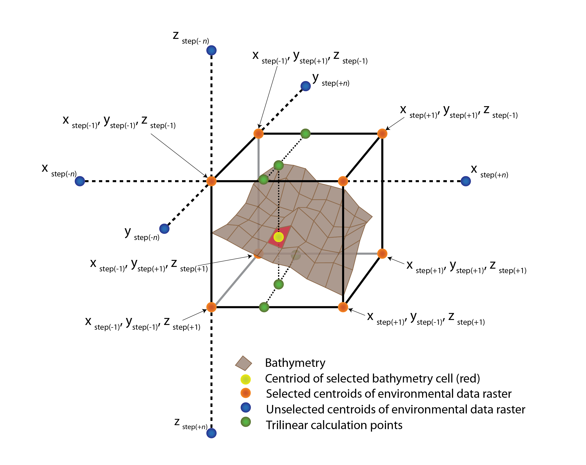

## GlobENV - Global environmental data for the deep-sea floor

### Rationale
The ocean is the largest habitat on earth, covering approximately 70% of the planet. Our knowledge of patterns within surface waters is fairly extensive, principally driven by the development of earth observing satellites. Whilst benthic marine scientists have clearly benefitted from such technologies, effectiveness is limited to the upper parts of the water column (e.g. ocean colour: Behrenfield & Falkowski 1997) or coarse gravity estimates of the sea-surface that correlate with ocean depth (Smith & Sandwell 1997). Accurate estimates of conditions at the seafloor remain scarce and are generally concentrated around developed countries (Ramirez-Llodra et al. 2010). Even with the now widespread adoption of technologies such as multibeam echosounders, remotely operated vehicles and autonomous underwater vehicles (Danovaro et al. 2014), only approximately 5% of the seafloor has been mapped at even moderate resolutions (<1km), and a far smaller area has been investigated in great detail (Ramirez-Llodra et al. 2010). Recently, there has been renewed interest in ocean exploration, driven by the need to have a better understanding of geological features, underwater resources and species distributions. However, studies in many parts of our ocean remain constrained by the availability of high quality and validated data on seafloor conditions.

### Towards new deep-sea environmental layers
Several marine climatologies are currently available. For example, Bio-ORACLE initially provided a data package that focusses on surface waters (Tyberghein et al. 2012) which was recently extended to include some benthic and future climate data (Assis et al. 2017). The MARSPEC dataset was based upon higher resolution bathymetric dataset (i.e. SRTM30 Becker et al. 2009), and provides several benthic terrain variables and temperature/salinity for the sea surface (Sbrocco & Barber 2013). The GlobENV approach and dataset aims to extend these previous climatologies by providing an up-scaling approach that can be applied to any bathymetric dataset available of any resolution by using the best available environmental data in the ocean. It extends a widely used upscaling approaches developed by Davies & Guinotte (2011), by providing a more robust interpolation technique that is more computationally efficient.

### GlobENV Methodology
<a href="./Images/Figure_1_light.png">
<picture>
  <source media="(prefers-color-scheme: dark)" srcset="./Images/Figure_1_dark.png">
  <source media="(prefers-color-scheme: light)" srcset="./Images/Figure_1_light.png">
  
  </picture>
</a>
Trilinear interpolation on a three-dimensional regular grid was used to estimate conditions on the seafloor from various environmental data sources (using scipy). This approach interpolates the value of a point at depth z with coordinates x and y from eight surrounding points obtained from regularly gridded environmental data (Figure 1). I originally developed this code for ArcGIS 10, and it was supremely challenging with memory limitations that are imparted from the 32-bit Python (2.7) that was bundled with the arcpy Python library. I have archived that codebase in the ["Code Legacy ArcGIS 10"](./Code_Legacy_ArcGIS10/) folder, and it does work but you would have to split your bathymetric file into small chunks due to memory issues. Your best bet would be to use the 64-bit geoprocessing addon that is available for ArcGIS 10.x. The current code requires ArcGIS Pro with Python 3 (64-bit) and GDAL, and is accessed in the ["Code Current ArcGIS Pro"](./Code_Current_ArcGISPro/) folder.

#### Step 1
Data preparation is 

 (Figure 1). GlobENV is designed to take gridded environmental data of varying resolution, and bathymetric data of an equal or finer resolution, producing an output that is an estimate of the variable at that particular depth and position. Finally, after computation of a variable (for an example see Figure 2), a validation process is conducted that compares performance against various environmental data. Several key parameters are calculated, 1) overall root-mean-square error, 2) spatial error calculations, 3) error by depth bin and 4) correlation metrics.

